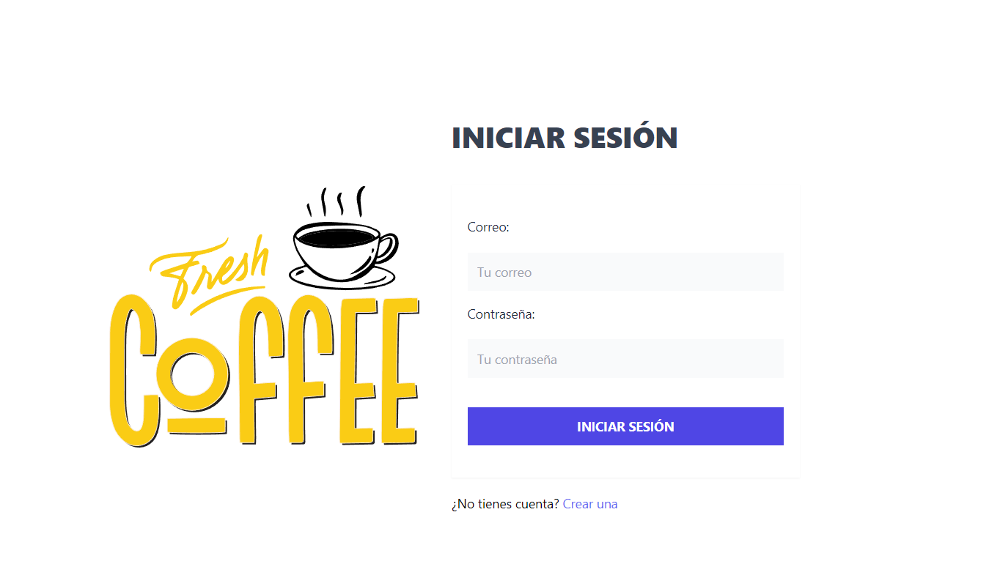
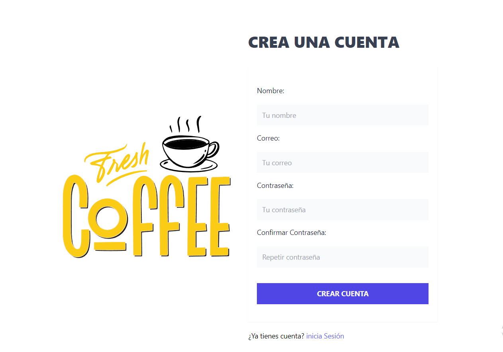
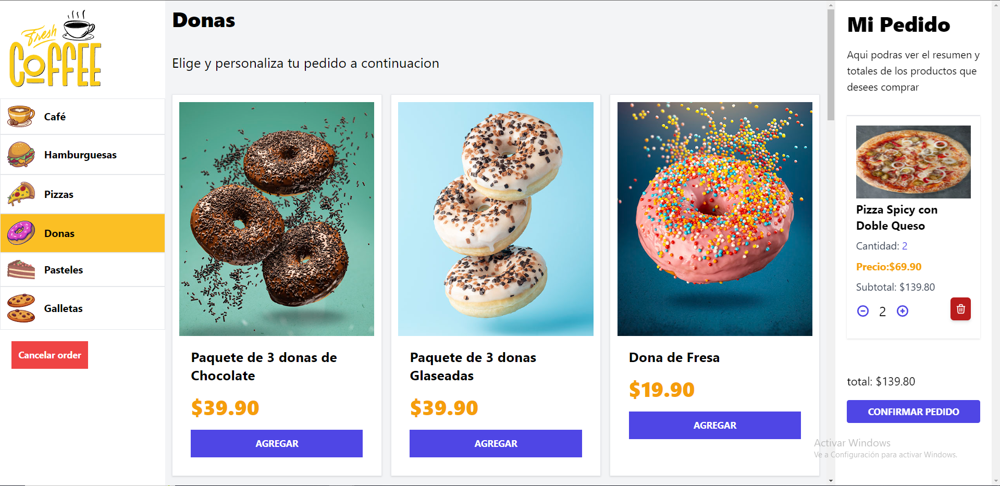

# FreshCoffe






## Introducción

proyecto React que utiliza TypeScript como lenguaje de programación, Tailwind CSS para estilos, Zustand para la gestión del estado y React Modal para la creación de modales en la aplicación. A continuación, se detalla el proceso de configuración y ejecución del proyecto.


## Requisitos previos

Asegúrate de tener corriendo el backend antes de continuar.

el backend se encuentra [aquí](https://github.com/Jacom3dev/FreshCoffe-Server.git)

## Correr proyecto

Despues de tener corriendo el backend y haber clonado el proyecto ejecuta el siguiente comando: 

```bash
npm i && npm run dev
